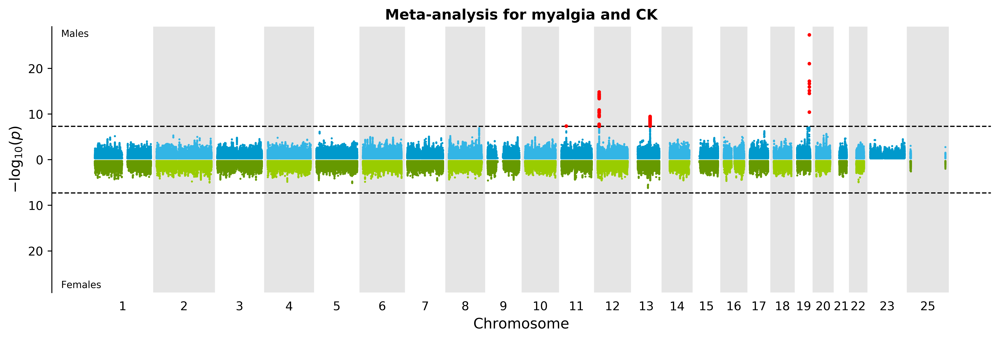

# Miami plot generator

`miami_generator` is a python tool to create beautiful Miami plots (which are a
combination of two Manhattan plots into a single image, showing the results
from two distinct group).


## Dependencies

The tool requires Python version 3 and recent versions of *numpy*, *matplotlib*
and *pandas*.


## Installation

The best way to install the tool is in a virtual python environment. The
following commands should work, considering that `$PATH_TO_VENV` is the path to
the virtual environment root directory, and `$PATH_TO_SETUP` is the path to the
directory containing the `setup.py` file for the tool.

```bash
. "$PATH_TO_VENV"/bin/activate
pip install -e "$PATH_TO_SETUP"
```


## Basic usage

```console
$ miami_generator --help
usage: miami_generator [-h] [--data FILE] [--up-data FILE]
                       [--up-data-label LABEL] [--down-data FILE]
                       [--down-data-label LABEL] [--separator SEP]
                       [--chromosome CHR] [--position POS] [--p-value P]
                       [--group COL] [--output FILE] [--format FORMAT]
                       [--dpi INT] [--up-colors COL COL]
                       [--down-colors COL COL] [--chromosome-box-color COLOR]
                       [--significant-color COLOR] [--graph-title TITLE]
                       [--axis-text-size INT] [--chr-text-size INT]
                       [--label-text-size INT] [--group-text-size INT]
                       [--graph-width WIDTH] [--graph-height HEIGHT]
                       [--abline P [P ...]] [--point-size SIZE]
                       [--significant-point-size SIZE]
                       [--chromosome-spacing VALUE]
                       [--significant-threshold FLOAT] [--max-p-value FLOAT]
                       [--p-value-sampling]
                       [--p-value-sampling-threshold FLOAT]
                       [--p-value-sampling-proportion FLOAT]

Creates a Miami plot from two datasets.

optional arguments:
  -h, --help            show this help message and exit

Input options:
  --data FILE           A file containing two datasets. You need to specify
                        the column which stratifies the two datasets.
  --up-data FILE        A file containing one of the two datasets. This
                        dataset will be at the top of the Miami plot.
  --up-data-label LABEL
                        The label for the datasets that will be at the top of
                        the Miami plot. If this value is not set and the data
                        comes from a single file, the label is automatically
                        generated.
  --down-data FILE      A file containing one of the two datasets. This
                        dataset will be at the bottom of the Miami plot.
  --down-data-label LABEL
                        The label for the datasets that will be at the bottom
                        of the Miami plot. If this value is not set and the
                        data comes from a single file, the label is
                        automatically generated.

Data format:
  --separator SEP       The file(s) field separator. [TAB]
  --chromosome CHR      The column containing the chromosomes. [chr]
  --position POS        The column containing the positions. [pos]
  --p-value P           The column containing the p-values. [p]
  --group COL           The column containing the groups (for single file
                        dataset).

Output options:
  --output FILE         The name of the output file. The extension will be
                        added if missing. [miami]
  --format FORMAT       The format of the plot (pdf, png). [png]
  --dpi INT             The quality of the output (in dpi). [600]

Graph color:
  --up-colors COL COL   The two colors (odd and even chromosomes) for the
                        upper part of the Miami plot.
  --down-colors COL COL
                        The two colors (odd and even chromosomes) for the
                        upper part of the Miami plot.
  --chromosome-box-color COLOR
                        The COLOR for the box surrounding even chromosome
                        numbers. [#E5E5E5]
  --significant-color COLOR
                        The color for points representing significant points.
                        [#FF0000]

Graph text:
  --graph-title TITLE   The TITLE of the graph.
  --axis-text-size INT  The axis font size. [10]
  --chr-text-size INT   The axis font size. [10]
  --label-text-size INT
                        The axis font size. [12]
  --group-text-size INT
                        The group label font size. [8]

Graph look:
  --graph-width WIDTH   The width of the graph, in inches. [14]
  --graph-height HEIGHT
                        The height of the graph, in inches. [4]
  --abline P [P ...]    The p-value(s) at which a horizontal line should be
                        drawn.
  --point-size SIZE     The size of each points. [0.5]
  --significant-point-size SIZE
                        The size of each significant points. [4.0]
  --chromosome-spacing VALUE
                        The spacing between two chromosomes. [2.5E+07]
  --significant-threshold FLOAT
                        The significant threshold for linkage or association.
                        [5.0E-08]

Optimization:
  --max-p-value FLOAT   Prevent plotting p-values higher than this cutoff.
                        [1.0]
  --p-value-sampling    Sample a subset of points for specific p-values (see '
                        --p-value-sampling-threshold' and '--p-value-sampling-
                        proportion'). [False]
  --p-value-sampling-threshold FLOAT
                        Points with p-values equal or higher than this
                        threshold will be sampled. [0.01]
  --p-value-sampling-proportion FLOAT
                        The proportion of points with a p-values equal or
                        higher than the threshold which will be kept for
                        plotting. [0.1]
```


## Example

As an example, we are using GWAS results which were generated for both men and
women.

```bash
miami_generator \
    --up-data ./data/males_results.tsv \
    --up-data-label Males \
    --down-data ./data/females_results.tsv \
    --down-data-label Females \
    --chromosome CHR \
    --position BP \
    --p-value "P(R)" \
    --chromosome-spacing 25e6 \
    --max-p-value 0.5 \
    --output ./example.png \
    --graph-title "Meta-analysis for myalgia and CK"
```

The following plot was generated.




If the data was present in a single file (with a column describing the two
groups), the following command would have generated the same image.

```bash
miami_generator \
    --data ./data/results.tsv \
    --chromosome CHR \
    --position BP \
    --group SEX \
    --p-value "P(R)" \
    --chromosome-spacing 25e6 \
    --max-p-value 0.5 \
    --output ./example.png \
    --graph-title "Meta-analysis for myalgia and CK"
```
